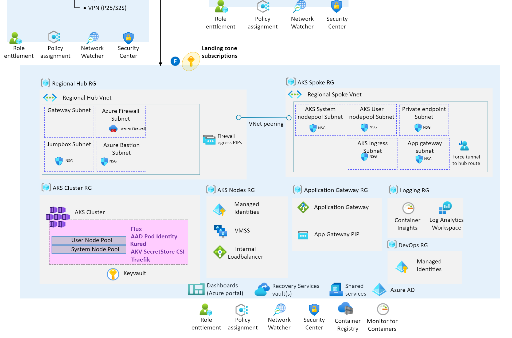

# terraform

This reference implementation of [AKS Baseline Architecture](https://docs.microsoft.com/en-us/azure/architecture/reference-architectures/containers/aks/secure-baseline-aks) is built on [CAF Terraform Landing zone framework composition](https://github.com/aztfmod/terraform-azurerm-caf).

The following components will be deployed by the Enterprise-Scale AKS Construction Set. You can review each component as described below:



| Components                                                                                              | Config files                                                 | Description|
|-----------------------------------------------------------|------------------------------------------------------------|------------------------------------------------------------|
| Global Settings |[global_settings.tfvars](../configuration/global_settings.tfvars) | Primary Region setting. Changing this will redeploy the whole stack to another Region|
| Resource Groups | [resource_groups.tfvars](../configuration/resource_groups.tfvars)| Resource groups configs |
| Azure Kubernetes Service | [aks.tfvars](../configuration/aks.tfvars) | AKS addons, version, nodepool configs |
||<p align="center">**Identity & Access Management**</p>||
| Identity & Access Management | [iam_aad.tfvars](../configuration/iam/iam_aad.tfvars) <br /> [iam_managed_identities.tfvars](../configuration/iam/iam_managed_identities.tfvars) <br /> [iam_role_mappings.tfvars](../configuration/iam/iam_role_mappings.tfvars)| AAD admin group, User Managed Identities & Role Assignments |
||<p align="center">**Gateway**</p>||
| Application Gateway | [agw.tfvars](../configuration/agw/agw.tfvars) <br /> [agw_application.tfvars](../configuration/agw/agw_application.tfvars) <br />| Application Gateway WAF v2 Configs with aspnetapp workload settings |
| App Service Domains | [domain.tfvars](../configuration/agw/domain.tfvars) | Public domain to be used in Application Gateway |
||<p align="center">**Networking**</p>||
| Virtual networks | [networking.tfvars](../configuration/networking/networking.tfvars) <br /> [peerings.tfvars](../configuration/networking/peerings.tfvars) <br /> [nsg.tfvars](../configuration/networking/nsg.tfvars) <br /> [ip_groups.tfvars](../configuration/networking/ip_groups.tfvars)| CIDRs, Subnets, NSGs & peerings config for Azure Firewall Hub & AKS Spoke |
| Private DNS Zone | [private_dns.tfvars](../configuration/networking/private_dns.tfvars) | Private DNS zone for AKS ingress; A record to Load Balancer IP |
| Azure Firewall  | [firewalls.tfvars](../configuration/networking/firewalls.tfvars) <br /> [firewall_application_rule_collection_definition.tfvars](../configuration/networking/firewall_application_rule_collection_definition.tfvars) <br /> [firewall_network_rule_collection_definition.tfvars](../configuration/networking/firewall_network_rule_collection_definition.tfvars) <br /> [route_tables.tfvars](../configuration/networking/route_tables.tfvars)  | Azure Firewall for restricting AKS egress traffic|
| Public IPs | [public_ips.tfvars](../configuration/networking/public_ips.tfvars) | Public IPs for Application Gateway, Azure Firewall & Azure Bastion Host |
||<p align="center">**Security & Monitoring**</p>||
| Azure Key Vault| [keyvaults.tfvars](../configuration/keyvault/keyvaults.tfvars) <br /> [certificate_requests.tfvars](../configuration/keyvault/certificate_requests.tfvars) | Key Vault to store Self signed certificate for AKS ingress & Bastion SSH key |
| Azure Monitor | [diagnostics.tfvars](../configuration/monitor/diagnostics.tfvars)  <br /> [log_analytics.tfvars](../configuration/monitor/log_analytics.tfvars) | Diagnostics settings, Log Analytics Workspace for AKS logs & Prometheus metrics |
||<p align="center">**Bastion**</p>||
| Azure Bastion (OPTIONAL) | [bastion.tfvars](../configuration/bastion/bastion.ignore) | Azure Bastion Host & Windows VM to view aspnetsample website internally. |

<br />


## Manual deployment
To build the [AKS Baseline Reference Implementation](https://github.com/mspnp/aks-baseline) manually using Azure CLI commands and the CAF terraform modules, follow these steps:

> 1- Make sure these [prerequisites](prerequisites.md) are in place.

> 2-Run these [manual](manual.md) commands.

## Standalone automated deployment with GitHub Actions
To automate the deployment using a GitHub Action pipeline, follow these steps:

1- Clone or fork this repository

2- Create your workflow [GitHub Environment](https://docs.github.com/en/actions/deployment/targeting-different-environments/using-environments-for-deployment?msclkid=62181fb1ab7511ec9be085113913a757) to store the following secrets:
| Secret | Description |Sample|
|--------|-------------|------|
|ENVIRONMENT| Name of the environment where you are deploying the Azure resources|non-prod|
|ARM_CLIENT_ID| Service Principal which will be used to provision resources||
|ARM_CLIENT_SECRET| Service Principal secret||
|ARM_SUBSCRIPTION_ID| Azure subscription id||
|ARM_TENANT_ID| Azure tenant id||
|FLUX_TOKEN| [GitHub Personal Access Token](https://docs.github.com/en/authentication/keeping-your-account-and-data-secure/creating-a-personal-access-token) for Flux V2||

Note: do not modify the names of these secrets in the workflow yaml file as they are expected in terraform to be named as shown above.

3- Clone the CAF terraform modules under the terraform folder:
```bash
cd IaC/terraform
git clone https://github.com/Azure/caf-terraform-landingzones.git landingzone
```

4- Run the following workflow pipeline from your working repository to deploy all the Azure resources: [.github/Workflows/IaC-terraform-standalone.yml](../../.github/workflows/IaC-terraform-standalone.yml).

## Landingzone automated deployment with GitHub Actions
TBD??